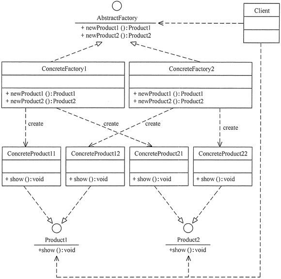
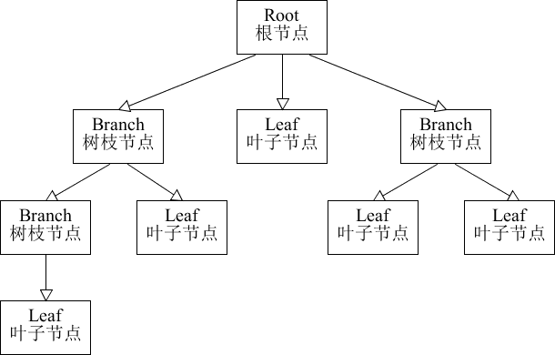

- 创建型 (怎样创建对象) 5

  单例, 抽象工厂 工厂方法, 生成器(建造者), 原型模式

- 行为型 (类和对象之间合作完成任务) 11

  观察者, 构造者 责任链, 命令, 解释器, 迭代器, 中介者, 备忘录, 状态, 策略, 访问者

- 结构性 (如何将类和对象布局呈更大的结构) 7

  代理, 适配器, 装饰 桥接, 组合, 外观, 享元

#### 单一职责原则 (SRP)

就一个类而言，应该仅有一个引起它变化的原因

#### 开放封闭原则 (Open closed principle)

对扩展开放，对修改关闭；

设计人员必须对于他设计的模块应该对哪种变化封闭做出选择。他必须先猜测出最有可能发生的变化种类，**然后构造抽象来隔离那些变化**；面对需求，对程序的改动是通过**增加新代码**进行的，而不是更改现有的代码

#### 依赖倒置原则

抽象不应该依赖细节，细节应该依赖于抽象；

针对接口编程，不要对实现编程；高层模块不应该依赖低层模块。两个都应该依赖抽象；抽象不应该依赖细节，细节应该依赖抽象

依赖倒转其实可以说是面向对象设计的标志，用哪种语言来编写程序不重要，如果编写时考虑的都是如何**针对抽象编程**而不是针对细节编程，即程序中所有的依赖关系都是终止于抽象类或者接口，那就是面向对象的设计，反之那就是过程化的设计了

#### 里氏替换原则

子类型必须能够替**换掉**它们的父类型

一个软件实体如果使用的是一个父类的话，那么一定适用于其子类，而且它察觉不出父类对象和子类对象的区别。也就是说，在软件里面，把父类都替换成它的子类，程序的行为没有变化；只有当子类可以替换掉父类，软件单位的功能不受到影响时，父类才能真正被复用，而子类也能够在父类的基础上增加新的行为

由于子类型的可替换性才使得使用父类类型的模块在无需修改的情况下就可以扩展

#### 迪米塔法则

如果两个软件实体无须直接通信，那么就不应当发生直接的相互调用，可以通过第三方转发该调用。其目的是降低类之间的耦合度，提高模块的相对独立性

#### 简单工厂

创建一个类通过switch case 创建对应的对象 (这里不符合 开放封闭 原则，添加新操作时候需要添加 case)

- 聚合：关系较弱

- 组合：部分和整体生命周期一样

#### 工厂方法

定义一个用于创建对象的接口，让子类决定实例化哪一个类。工厂方法使一个类的实例化延迟到其子类。

#### 抽象工厂

提供一个创建一系列相关 或 互相依赖对象的接口，无需指定它们具体的类

#### 策略

策略模式是一种定义一系列算法的方法，从概念上来看，所有这些算法完成的都是相同的工作，只是实现不同，它可以以相同的方式调用所有的算法，减少了各种算法类与使用算法类之间的耦合；

策略模式的Strategy类层次为Context定义了一系列的可供重用的算法或行为。继承有助于析取出这些算法中的公共功能；

当不同的行为堆砌在一个类中时，就很难避免使用条件语句来选择合适的行为。将这些行为封装在一个个独立的Strategy类中，可以在使用这些行为的类中消除条件语句；

简化了单元测试，**封装了变化**

#### 装饰器

被装饰的对象 和 装饰器本身 要实现同一个接口

当系统需要新功能的时候，是向旧的类中添加新的代码。这些新加的代码通常装饰了原有类的**核心职责**或主要行为

#### 代理

为其他对象提供一种代理以控制对这个对象的访问

代理类 和 被代理类 要实现同一个接口

#### 原型

Prototype，用原型实例指定创建对象的种类，并且通过**拷贝**这些原型创建新的对象

#### 模板方法

定义一个操作中的算法的**骨架**，而将一些步骤**延迟到子类**中。

模板方法将不变的行为移动到父类，使得子类可以不改变一个算法的结构即可重定义该算法的某些特定步骤。

#### 外观(门面)

通过为多个复杂的子系统提供一个一致的接口，而使这些子系统更加容易被访问的模式。该模式对外有一个统一接口，外部应用程序不用关心内部子系统的具体细节

外观类需要了解所有子系统的方法和属性，进行组合，以备外界调用

#### 建造者(生成器)

将一个复杂对象的构造与它的表示分离，使同样的构建过程可以创建不同的表示

用于创建一些复杂的对象，这些对象内部构建间的建造顺序通常是稳定的，但对象内部的构建通常面临着复杂的变化；

只需要指定建造的类型，不需要知道建造的过程和细节；

#### 观察者

定义了一种一对多的依赖关系，让多个观察者对象同时监听某一个主题对象。这个主题对象在状态发生变化时，会通知所有观察者对象，使它们能够自动更新自己。

使用场景：当一个对象的改变需要同时改变其它对象 (不知道有多少对象需要改变) 时

#### 状态

当一个对象的内在状态改变时允许改变其行为

状态模式主要解决的是当控制一个对象状态转换的条件表达式过于复杂时的情况。把状态的判断逻辑转移到表示不同状态的一系列类当 中，可以把复杂的判断逻辑简化；

#### 适配器

对象适配器，类适配器

适配器模式(Adapter)，将一个类的接口转换成客户希望的另外一个接口。Adapter模式使得原本由于接口不兼容而不能一起工作的那些类可以一起工作。

两个类所做的事情**相同或相似，但是具有不同的接口**，双方都不太容易修改的时候再使用适配器模式适配；

实现客户需要的接口，使用现有的类重写接口中的方法

#### 备忘录 (快照)

在不破坏封装性的前提下，捕获一个对象的内部状态，并在该对象之外保存这个状态，以便以后当需要时能将该对象恢复到原先保存的状态

1. 发起人（Originator）角色：(需要**被记录**的对象)记录当前时刻的内部状态信息，提供创建备忘录和恢复备忘录数据的功能，实现其他业务功能，它可以访问备忘录里的所有信息。
2. 备忘录（Memento）角色：负责**存储**发起人的内部状态，在需要的时候提供这些内部状态给发起人。
3. 管理者（Caretaker）角色：对备忘录进行**管理**(只有 set/get 备忘录方法)，提供保存与获取备忘录的功能，但其不能对备忘录的内容进行访问与修改。

#### 组合

是一种将对象组合成**树状**的层次结构的模式，用来表示“整体 - 部分”的关系，使用户对单个对象和组合对象具有一致的访问性

组合模式让客户可以一致地使用组合结构和单个对象。

#### 迭代器

迭代器模式(Iterator)，提供一种方法顺序访问一个聚合对象中各个元素，而又不暴露该对象的内部表示。

#### 单例

#### 桥接模式

将抽象与实现分离，使它们可以独立变化

组合：生命周期相同 (较强)

聚合：

#### 命令模式

将一个请求封装为一个对象，使发出请求的责任和执行请求的责任分割开

电视机遥控器（命令发送者）通过按钮（具体命令）来遥控电视机（命令接收者）

#### 责任链

为了避免请求发送者与多个请求处理者耦合在一起，于是将所有请求的处理者通过前一对象记住其下一个对象的引用而连成一条**链**；当有请求发生时，可将请求沿着这条链传递，直到有对象处理它为止

#### 中介者

迪米特法则的典型应用

定义一个中介对象来**封装一系列对象之间的交互**，使原有对象之间的耦合松散，且可以独立地改变它们之间的交互

中介者模式一般应用于一组对象以定义良好但是复杂的方式进行通信的场合；

#### 享元

运用共享技术来有效地支持大量细粒度对象的复用；为了使对象可以共享，需要将一些不能共享的状态外部化

#### 解释器

给分析对象定义一个语言，并定义该语言的文法表示，再设计一个解析器来解释语言中的句子

通常当有一个语言需要解释执行，井且可将该语言中的句子表示为一个抽象语法树时，可使用解释器模式；

可以很容易地改变和扩展文法，因为该模式使用类来表示文法规则，可使用继承来改变或扩展该文法。也比较容易实现文法，因为定义抽象语法树中各个节点的类的实现大体类似，这些类都易于直接编写；

#### 访问者

将作用于某种数据结构中的各元素的操作分离出来封装成独立的类，使其在不改变数据结构的前提下可以添加作用于这些元素的新的操作，为数据结构中的每个元素提供多种访问方式；

适用于数据结构相对稳定的系统

