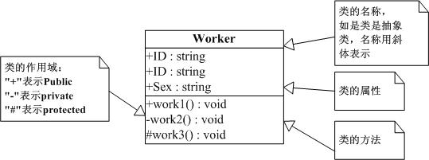
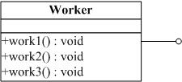
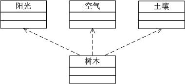
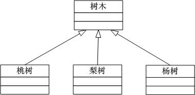
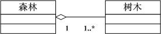
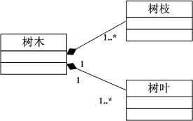
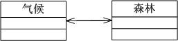
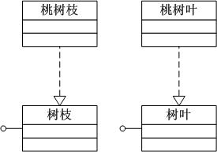

**1、什么是类图**

类图(Class diagram)主要用于描述系统的结构化设计。类图也是最常用的UML图，用类图可以显示出类、接口以及它们之间的静态结构和关系。

**2、类图的元素**

在类图中一共包含了以下几种模型元素，分别是：类（Class）、接口（Interface）、依赖（Dependency）关系、泛化（Generalization）关系、关联（Association）关系、聚合关系（Aggregation）、组合关系（Composition）和实现（Realization）关系。

**2.1 类（Class)**

在面向对象（OO) 编程中，类是对现实世界中一组具有相同特征的物体的抽象。

**2.2 接口（Interface）**

接口是一种特殊的类，具有类的结构但不可被实例化，只可以被实现（继承）。在UML中，接口使用一个带有名称的小圆圈来进行表示。

**2.3 依赖（Dependency）关系**

依赖关系是指两个或多个类之间的依存关系，如植物类依赖于土壤类。 依赖关系还可以再细分为5种类型，分别是绑定（Binding）依赖、实现（Realization）依赖、使用（Usage）依赖、抽象（Abstraction）依赖和授权（Permission）依赖。

依赖关系用虚线箭头来表示，箭头指向为依赖的方向。

**2.4 泛化（Generalization）关系**

简单的讲就是类之间的继承关系。在UML中，泛化关系用空心三角形+实线来表示，箭头指向为父类。

**2.5 聚合（Association）关系**

聚合关系是类之间的一种较弱的耦合关系，如一个字符串数组和一个字符串就是一种聚合关系。在UML中类图中，聚合关系用空心的菱形+实线箭头来表示，箭头指向为被聚合的类。

**2.6 组合（Aggregation）关系**

组合关系是类之间一种整体与部分之间的关系，如一只青蛙有四条腿，青蛙类与青蛙腿类之间的关系就是组合关系。在UML类图中，组合关系用实心的菱形+实线箭头来表示，箭头指向为被组合的类。

**2.7 关联（Composition）关系**

关联关系是类之间一种相互影响的关系，影响的方向就是关联的方向。在UML类图中，组合关系用实线箭头来表示。

**2.8 实现（Realization）关系**

一般来讲实现关系是针对类与接口之间的关系而言的。在UML类图中，实现关系用空心三角形+虚线来表示。

**3、简单的类图示例**

